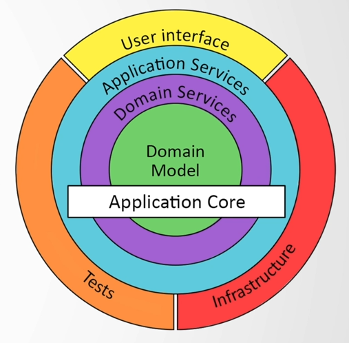
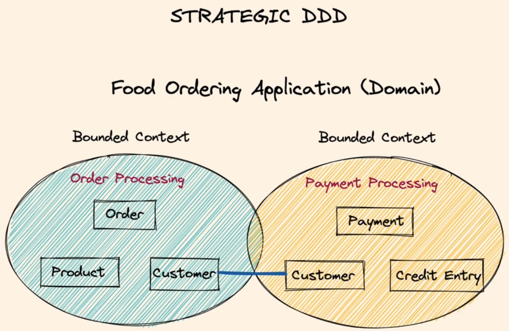
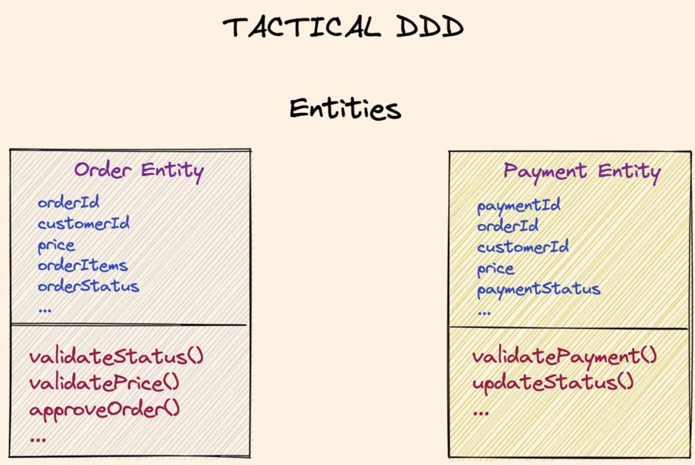
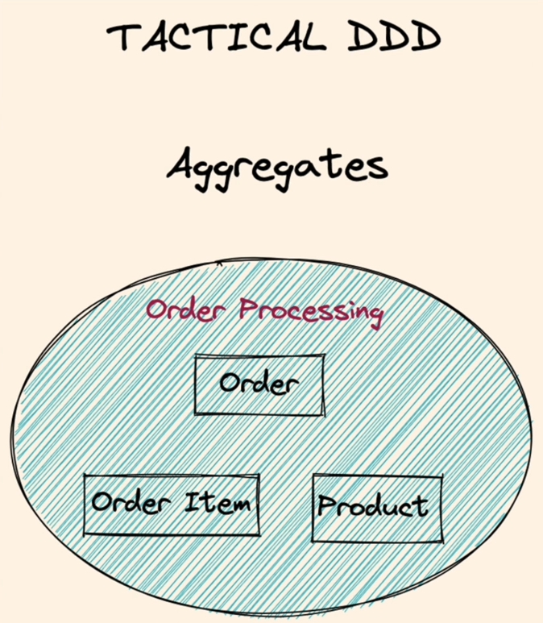
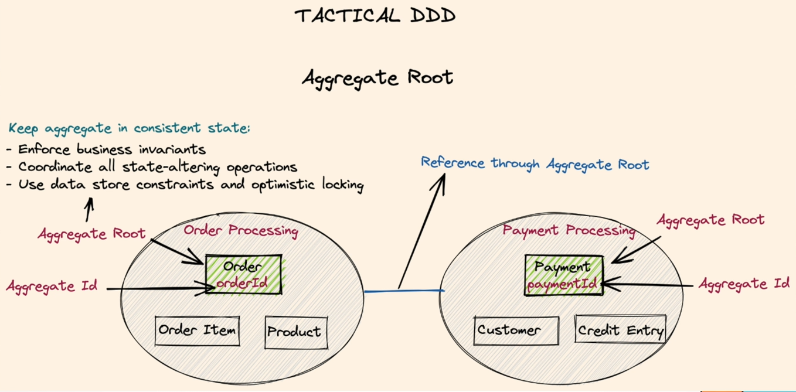
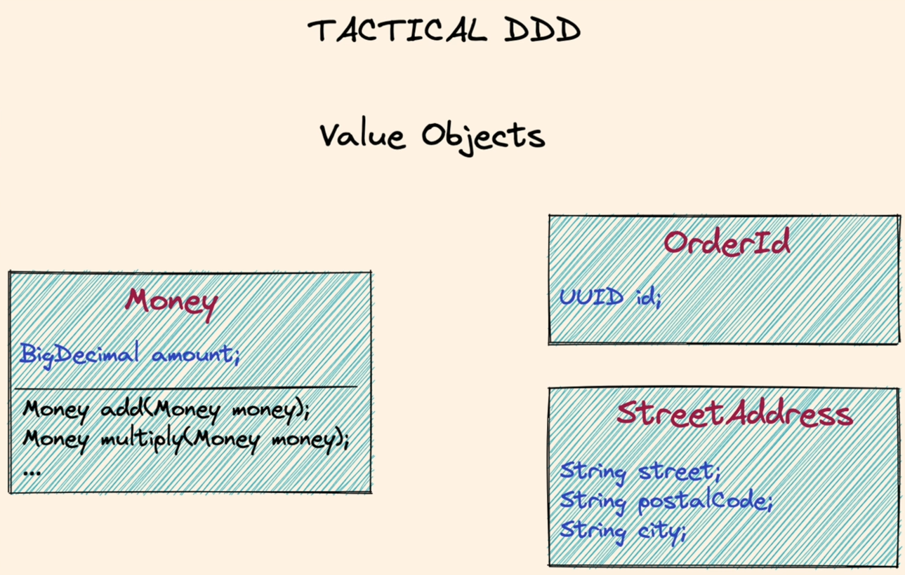
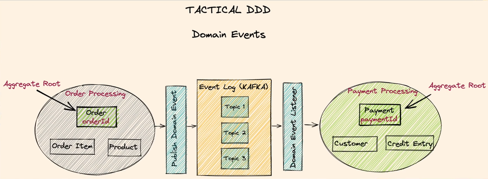
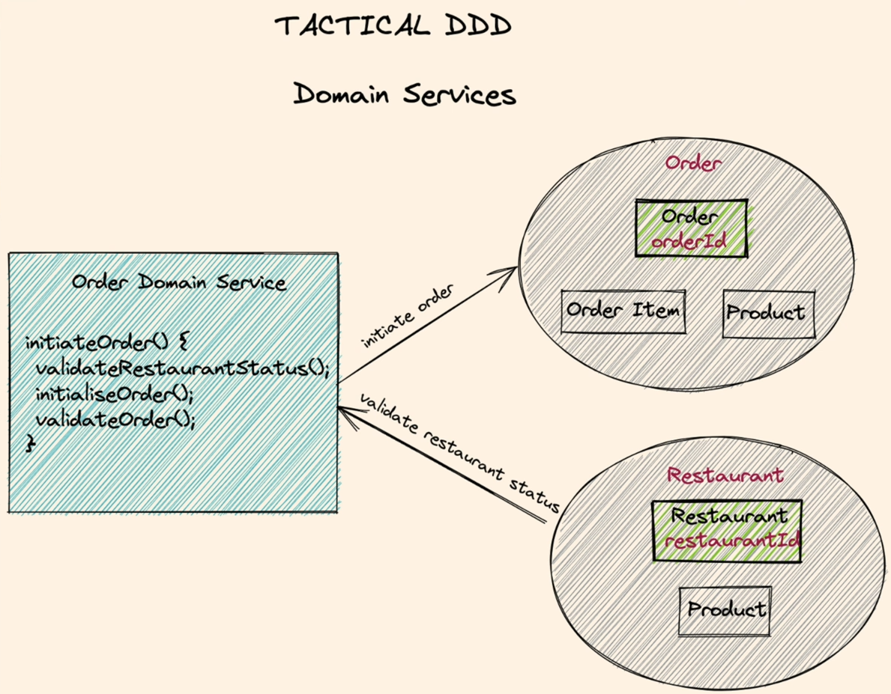
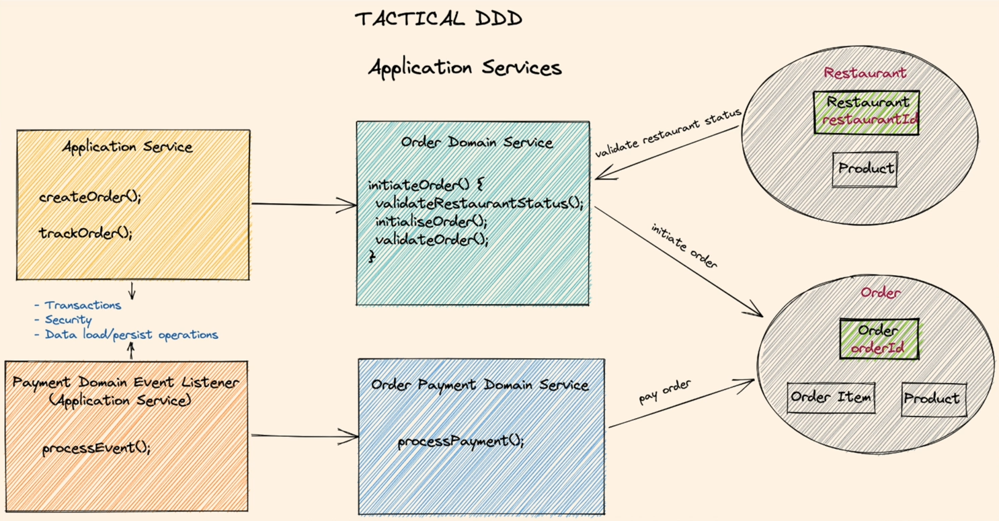

= Hexagonal Architecture

Hexagonal architecture is a software architecture pattern that promotes the use of ports and adapters. It is also known as ports and adapters, hexagonal, onion, or clean architecture.
It contains input ports and output ports.
Input ports are used to receive data from the outside world. Output ports are used to send data to the outside world.
Dependency Inversion Principle is used to decouple the application from the outside world.

image:target%2Fdependency-graph.png[dependency-graph.png]

= Domain-Driven Design

Domain-driven design offers solutions to common problems when building enterprise software.
Domain model is a conceptual model of the domain that defines the behavior and data of a system.
Domain model is the core of the application. It is the most important part of the application.

= Strategic DDD vs Tactical DDD

Strategic DDD introduces boundaries for the domain model. Single bounded context per each domain model is recommended.
What is a Domain? Operational area of your application, for example, online food ordering.
Bounded Context - Central pattern in DDD. It is a boundary within a Domain.

A domain can have one or more subdomains depending on the domain logic.

Ubiquitous Language - The language that is used by the domain experts and the developers. It is the same language that is used in the domain model.

Tactical DDD is focused on implementation patterns.

* Entities - Domain object with a unique identity. Embodies a set of critical business rules. - Mutable Objects

* Aggregates - A group of entity objects which always need to be in consistent state.

* Aggregate Root - Entry point Entity for an aggregate. All business operations should go through root.
An aggregate should be referenced from outside through its root only. AR should have pure, side-effect free functions.

* Value Objects - Immutable objects that are used to describe an entity. They are not entities themselves. They are used to describe an entity. Immutable objects without identity. Only value matters. Brings context to the value.

* Domain Events - Domain events are used to notify other parts of the application about something that has happened in the domain. They are used to decouple the application from the outside world. They are used to notify other parts of the application about something that has happened in the domain. They are used to decouple the application from the outside world.
Decouple different domains. Describe things that happen and change the state of a domain. Makes the system extendable.
Domain event listeners runs in a different transaction that the event publishes. In Domain-driven systems, domain events
are an excellent way of achieving eventual consistency. Any system or module that needs to update itself when something happens in another module or system
can subscribe to the domain events coming from that system.

* Domain Service - Business logic that cannot fit in the aggregate. Used when multiple aggregates required in business logic. It can interact with other domain services. It can interact with other aggregates. It can interact with other domain services.

* Application Service - Allows the isolated domain to communicate with outside. Orchestrate transaction, security, looking up proper
aggregates and saving state changes of the domain to the database. Does not contain any business logic. Domain event listeners are a special
kind of Application Services that is triggered by domain events. Each domain event listener can have a separate domain service to handle business logic.

