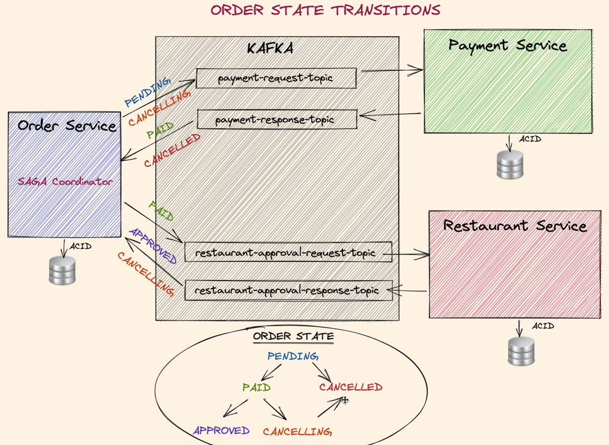
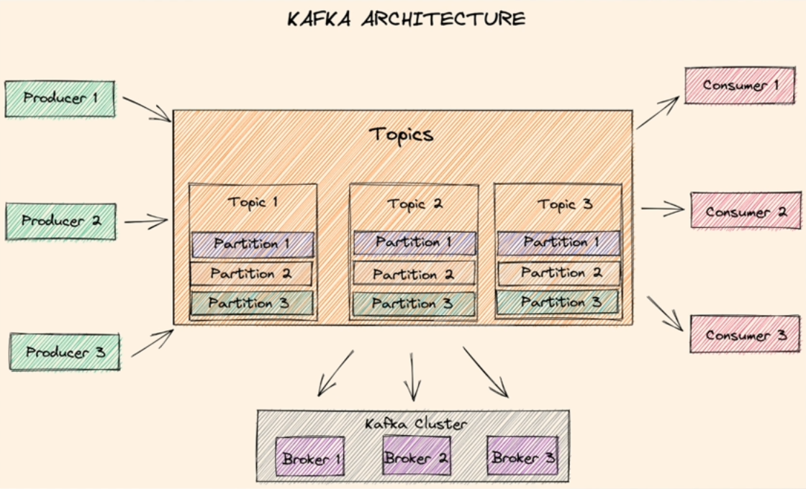
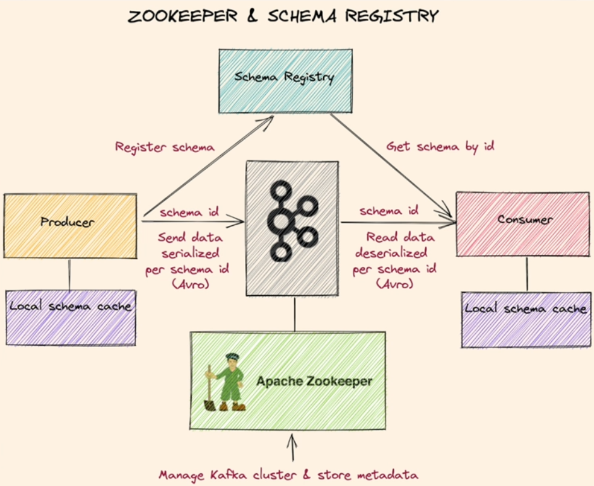
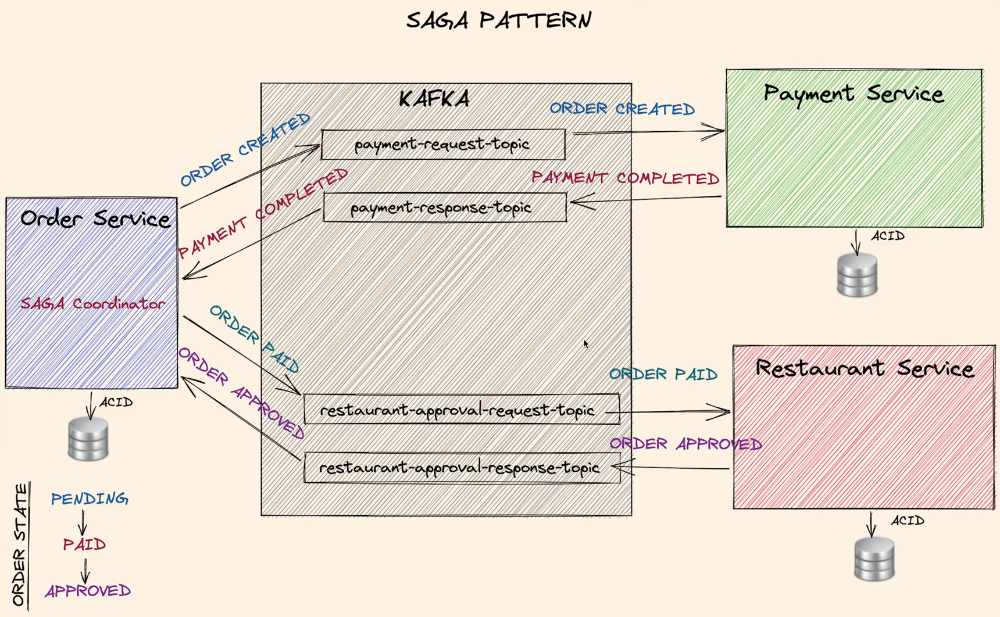
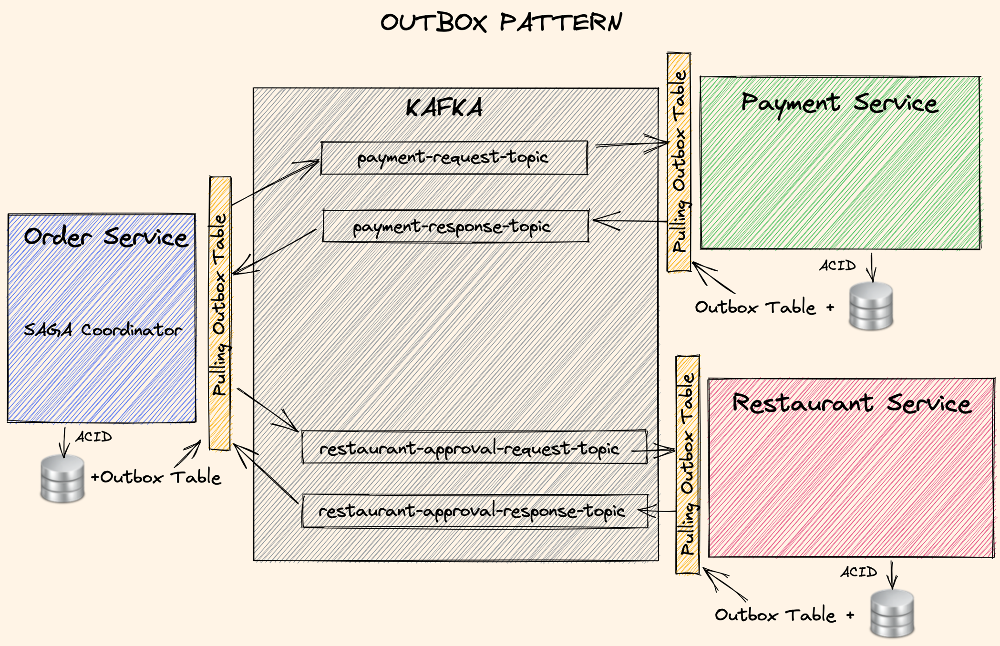
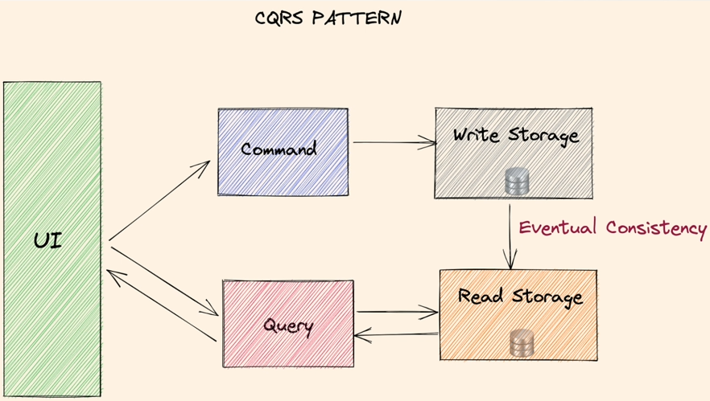

# Hexagonal Architecture

Hexagonal architecture is a software architecture pattern that promotes the use of ports and adapters. It is also known as ports and adapters, hexagonal, onion, or clean architecture.
It contains input ports and output ports.
Input ports are used to receive data from the outside world. Output ports are used to send data to the outside world.
Dependency Inversion Principle is used to decouple the application from the outside world.

# Domain-Driven Design

Domain-driven design offers solutions to common problems when building enterprise software.
Domain model is a conceptual model of the domain that defines the behavior and data of a system.
Domain model is the core of the application. It is the most important part of the application.

# Strategic DDD vs Tactical DDD

Strategic DDD introduces boundaries for the domain model. Single bounded context per each domain model is recommended.
What is a Domain? Operational area of your application, for example, online food ordering.
Bounded Context - Central pattern in DDD. It is a boundary within a Domain.

A domain can have one or more subdomains depending on the domain logic.

Ubiquitous Language - The language that is used by the domain experts and the developers. It is the same language that is used in the domain model.

Tactical DDD is focused on implementation patterns.

* Entities - Domain object with a unique identity. Embodies a set of critical business rules. - Mutable Objects

* Aggregates - A group of entity objects which always need to be in consistent state.

* Aggregate Root - Entry point Entity for an aggregate. All business operations should go through root.
An aggregate should be referenced from outside through its root only. AR should have pure, side-effect free functions.

* Value Objects - Immutable objects that are used to describe an entity. They are not entities themselves. They are used to describe an entity. Immutable objects without identity. Only value matters. Brings context to the value.

* Domain Events - Domain events are used to notify other parts of the application about something that has happened in the domain. They are used to decouple the application from the outside world. They are used to notify other parts of the application about something that has happened in the domain. They are used to decouple the application from the outside world.
Decouple different domains. Describe things that happen and change the state of a domain. Makes the system extendable.
Domain event listeners runs in a different transaction that the event publishes. In Domain-driven systems, domain events
are an excellent way of achieving eventual consistency. Any system or module that needs to update itself when something happens in another module or system
can subscribe to the domain events coming from that system.

* Domain Service - Business logic that cannot fit in the aggregate. Used when multiple aggregates required in business logic. It can interact with other domain services. It can interact with other aggregates. It can interact with other domain services.

* Application Service - Allows the isolated domain to communicate with outside. Orchestrate transaction, security, looking up proper
aggregates and saving state changes of the domain to the database. Does not contain any business logic. Domain event listeners are a special
kind of Application Services that is triggered by domain events. Each domain event listener can have a separate domain service to handle business logic.

* Order Service Domain Layer - Logic 

* Order State Transitions

# Kafka Architecture - High Level

* Kafka brokers - servers that form a cluster and serve to producers and consumers to insert and read data. Having multiple brokers in a cluster is important for high availability. With different servers, Kafka can replicate the data on different notes and be more resilient. 
* Topics - logical data units that hold multiple partitions. 
* Partitions are the smallest physical storage units that holds the data. Data can replicated on different partitions and kafka brokers.
* Producers - writes data to end of a specific partition.   
* Consumers - reads the data from a partition using an offset. They keep an offset with an ID, so they know where to start in case of restart.
* Replication - resilient and fault-tolerant.
* Scaling Partition Strategy.
* Immutable append-only event logs - once the data is inserted it cannot be changed or updated, so it is immutable.

# Zookeper and Schema Registry

* Zookeeper - manages the cluster and stores the metadata.
* Schema registry - stores versioned history of all schemas by ID.
* Producers send the schema to schema registry and get a schema ID. Producer uses this schema to serialize the data, if you use Avro then this will be Avro Serialization and it sends the data with the ID to the Kafka Broker. 
* Consumer will read the ID and the serialized data and get the schema from the schema registry by querying it with an ID and it simply deserializes the data using this schema.
* Data is serialized/deserialized with registered schema.

# SAGA Pattern

* Saga pattern is a distributed transaction pattern. It is used to coordinate multiple microservices in a distributed system. It is used for Long Lived Transactions (LLT). 
* Chain of local ACID transactions to finalise a long-running transaction across services.
* Compensating transactions: If one of the transactions fails, the saga will roll back all the transactions that have been executed so far. Rollback in case of failure.
* Saga Step interface - defines the methods that are used to execute the transaction and to rollback the transaction. 
* The methods are process() and rollback().

# Outbox Pattern

* It helps the use of local ACID transactions to let consistent(eventual) distributed transactions.
* It completes SAGA in a safe and consistent way.
* Persist events in local database automatically with ACID transactions.
* Read the events and publish.
  * Pulling Outbox Table: Pull the events with a scheduler
  * Change Data Capture: Listen transaction logs
* Keep track of saga and order status in Outbox Table.
* Ensure idempotency: Do not consume same data.
* Optimistic locks and DB Constraints: Prevent data corruption.

# CQRS Pattern

* CQRS stands for Command Query Responsibility Segregation. It is a pattern that separates read and write operations for a data store.
* Separates read and write operations. Better performance on read part using right technology for reading, and preventing conflicts with update commands. Scale each part separately.
* Leads to eventual consistency, as the read store is updated asynchronously.
* Once the write is persisted, an event is stored in event-store. Event store is a log of events that happened in the system.
* Events can be replayed multiple times based on requirements to create different type of query store.

# Kubernetes Concepts

* Kubernetes is an open-source system for automating deployment, scaling, and management of containerized applications.
* The physical servers or virtual machines that create the kubernetes cluster are called **Nodes**.
* The smallest unit of execution in kubernetes are called **Pods**. They are deployable units, and consists of one or more containers, which internally consist of one or more applications.
* To deploy, manage and scale the pods we use the **Controllers**
* To expose deployments through NodePort or LoadBalancer we use **Services**
* **NodePort** exposes the service on a static port on the node IP Address. NodePorts are in the 30000-32767 range by default.
* When exposing a kubernetes service, point the external IP to nodes, set firewall rules to access to node.
* **LoadBalancer** exposes a single external IP, and internally holds multiple ports to distribute the load.
* **Ingress** is a collection of rules that allow inbound connections to reach the cluster services.
* **ConfigMap** is a way to store non-confidential data in key-value pairs.
* **Secret** is a way to store confidential data in key-value pairs.
* **PersistentVolume** is a piece of storage in the cluster that has been provisioned by an administrator.
* **PersistentVolumeClaim** is a request for storage by a user.
* **StatefulSet** is a controller that provides guarantees about the ordering and uniqueness of Pods.
* **DaemonSet** ensures that all (or some) Nodes run a copy of a Pod.
* **Job** is a controller that manages Pods that run to completion.
* **CronJob** is a controller that manages time-based Jobs, namely: once at a specified point in time, once at a specified point in time repeatedly, once at a specified point in time repeatedly in a given time zone.
* **ReplicaSet** is the next-generation ReplicationController. The only difference between a ReplicaSet and a ReplicationController right now is the selector support. ReplicaSet supports the new set-based selector requirements as described in the labels user guide while a ReplicationController only supports equality-based selector requirements.
* **Deployment** is a higher-level API object that manages ReplicaSets and provides declarative updates to Pods along with a lot of other useful features.